# Callgraph and module inventory

## Visual dependency graph

Nodes are scripts; arrows are import dependencies. Shared utilities (`_shared.py`) sit at the root and feed every analysis module. Modelling scripts read cached out-of-fold predictions emitted by calibration (02), and the manuscript builders (20, 27) consume the downstream CSV outputs.

```mermaid
graph LR
    classDef shared fill:#fff7e0,stroke:#aa7700,stroke-width:2px;
    classDef model fill:#e6f3ff,stroke:#1f4e79;
    classDef cea   fill:#fef2dc,stroke:#d4621a;
    classDef doc   fill:#e8f7e8,stroke:#2a8a3f;

    S02_calibration["02_calibration.py"]
    S03_dca["03_dca.py"]
    S04_loho["04_loho.py"]
    S05_temporal_leakage["05_temporal_leakage.py"]
    S06_overfitting["06_overfitting.py"]
    S07_missing_data["07_missing_data.py"]
    S08_eicu_cohort["08_eicu_cohort.py"]
    S09_competing_risks["09_competing_risks.py"]
    S10_11_cea_pairwise["10_11_cea_pairwise.py"]
    S12_nis_seizure_reclassify["12_nis_seizure_reclassify.py"]
    S13_nis_grouped_lasso["13_nis_grouped_lasso.py"]
    S14_decision_tree["14_decision_tree.py"]
    S15_radiology_nlp["15_radiology_nlp.py"]
    S16_voi_evpi["16_voi_evpi.py"]
    S17_build_slides["17_build_slides.py"]
    S18_bidmc_optimize["18_bidmc_optimize.py"]
    S19_transfer_learning["19_transfer_learning.py"]
    S20_build_manuscript["20_build_manuscript.py"]
    S21_imbalance_sweep["21_imbalance_sweep.py"]
    S22_diverse_stacking["22_diverse_stacking.py"]
    S23_tabpfn_eval["23_tabpfn_eval.py"]
    S24_firth_bayes_lr["24_firth_bayes_lr.py"]
    S25_conformal_prediction["25_conformal_prediction.py"]
    S26_main_figures["26_main_figures.py"]
    S27_build_jnnp_manuscript["27_build_jnnp_manuscript.py"]
    S28_make_callgraph["28_make_callgraph.py"]
    S_shared["_shared.py"]
    class S_shared shared;
    class S02_calibration,S06_overfitting,S18_bidmc_optimize,S19_transfer_learning,S21_imbalance_sweep,S22_diverse_stacking,S23_tabpfn_eval,S24_firth_bayes_lr,S25_conformal_prediction model;
    class S10_11_cea_pairwise,S14_decision_tree,S16_voi_evpi cea;
    class S17_build_slides,S20_build_manuscript,S26_main_figures,S27_build_jnnp_manuscript doc;
    S02_calibration --> S_shared
    S02_calibration --> S_shared
    S03_dca --> S_shared
    S03_dca --> S_shared
    S04_loho --> S_shared
    S04_loho --> S_shared
    S05_temporal_leakage --> S_shared
    S05_temporal_leakage --> S_shared
    S06_overfitting --> S_shared
    S06_overfitting --> S_shared
    S07_missing_data --> S_shared
    S07_missing_data --> S_shared
    S08_eicu_cohort --> S_shared
    S08_eicu_cohort --> S_shared
    S09_competing_risks --> S_shared
    S09_competing_risks --> S_shared
    S10_11_cea_pairwise --> S_shared
    S10_11_cea_pairwise --> S_shared
    S12_nis_seizure_reclassify --> S_shared
    S12_nis_seizure_reclassify --> S_shared
    S13_nis_grouped_lasso --> S_shared
    S13_nis_grouped_lasso --> S_shared
    S14_decision_tree --> S_shared
    S14_decision_tree --> S_shared
    S15_radiology_nlp --> S_shared
    S15_radiology_nlp --> S_shared
    S16_voi_evpi --> S_shared
    S16_voi_evpi --> S_shared
    S17_build_slides --> S_shared
    S17_build_slides --> S_shared
    S18_bidmc_optimize --> S_shared
    S18_bidmc_optimize --> S_shared
    S19_transfer_learning --> S_shared
    S19_transfer_learning --> S_shared
    S20_build_manuscript --> S_shared
    S20_build_manuscript --> S_shared
    S21_imbalance_sweep --> S_shared
    S21_imbalance_sweep --> S_shared
    S22_diverse_stacking --> S_shared
    S22_diverse_stacking --> S_shared
    S23_tabpfn_eval --> S_shared
    S23_tabpfn_eval --> S_shared
    S24_firth_bayes_lr --> S_shared
    S24_firth_bayes_lr --> S_shared
    S25_conformal_prediction --> S_shared
    S25_conformal_prediction --> S_shared
    S26_main_figures --> S_shared
    S26_main_figures --> S_shared
    S27_build_jnnp_manuscript --> S_shared
    S27_build_jnnp_manuscript --> S_shared
```

## Per-script function inventory

Each script is single-purpose, executable from the command line, deterministic (SEED=42, n_jobs=1), and produces CSV results and PNG/PDF figures in fixed output paths.

### `02_calibration.py`
**Imports:** matplotlib, numpy, pandas, sklearn

| Function | Args | Purpose |
|---|---|---|
| `bootstrap_calibration_ci` | `y, p, n_boot, seed` | Fix F: paired-bootstrap 95% CI for Brier, CITL, slope/intercept, AUC. |
| `run_one` | `name, make_pipe, X, y, n_splits, n_repeats` | — |
| `main` | `` | — |

### `03_dca.py`
**Imports:** matplotlib, numpy, pandas

| Function | Args | Purpose |
|---|---|---|
| `net_benefit` | `y, p, t` | Net benefit at threshold t. |
| `treat_all_nb` | `y, t` | — |
| `main` | `` | — |

### `04_loho.py`
**Imports:** matplotlib, numpy, pandas, sklearn

| Function | Args | Purpose |
|---|---|---|
| `make_pipe_light` | `features` | Lighter pipeline (200 trees) for LOHO speed. |
| `loho_for` | `df, features, set_name, cohort_name, ckpt_path` | Returns a DataFrame; supports incremental checkpointing. |
| `main` | `` | — |
| `hanley_mcneil_var` | `auc, n1, n0` | Approximate variance of AUC (Hanley & McNeil 1982). |
| `logit` | `p` | — |
| `invlogit` | `x` | — |
| `random_effects_pool` | `g` | DerSimonian–Laird pooling on logit-AUC scale. |

### `05_temporal_leakage.py`
**Imports:** matplotlib, numpy, pandas, sklearn

| Function | Args | Purpose |
|---|---|---|
| `auc_with_ci` | `y, p, n_boot, seed` | — |
| `is_leakage_suspect_feature` | `c` | — |
| `main` | `` | — |

### `06_overfitting.py`
**Imports:** imblearn, matplotlib, numpy, pandas, scipy, sklearn

| Function | Args | Purpose |
|---|---|---|
| `make_rf` | `features, min_leaf` | — |
| `make_lr` | `features` | — |
| `make_selectk_rf` | `features, k, min_leaf` | — |
| `cv_auc` | `make_fn, X, y, n_splits, n_repeats` | — |
| `variable_importance_stability` | `X, y, n_splits, n_repeats, top` | — |
| `learning_curve_plot` | `X, y, ax` | — |
| `main` | `` | — |

### `07_missing_data.py`
**Imports:** imblearn, matplotlib, numpy, pandas, scipy, sklearn

| Function | Args | Purpose |
|---|---|---|
| `missingness_vs_outcome` | `df, features, outcome_col` | Chi-square (or Fisher) test: does missingness of each feature |
| `littles_mcar_test` | `df, features` | Simplified Little's MCAR test (Little 1988). |
| `rubin_pool_auc` | `aucs, ses` | Rubin's rules pooling: combine point estimates and SEs across M imputations. |
| `make_pipe` | `imputer, features, model` | — |
| `cv_auc` | `pipe_fn, X, y, n_splits, n_repeats` | — |
| `main` | `` | — |

### `08_eicu_cohort.py`
**Imports:** matplotlib, numpy, pandas, sklearn

| Function | Args | Purpose |
|---|---|---|
| `cv_auc` | `make_fn, X, y, n_splits, n_repeats` | Repeated CV AUC + bootstrap 95% CI on first-repeat OOF predictions. |
| `main` | `` | — |

### `09_competing_risks.py`
**Imports:** lifelines, matplotlib, numpy, pandas, sklearn

| Function | Args | Purpose |
|---|---|---|
| `make_event_time_data` | `df, horizon_days, missing_strategy` | status: 1 = seizure, 2 = death, 0 = censored. |
| `discrete_time_auc` | `d, n_splits, n_repeats` | — |
| `cox_concordance` | `d, ph_test` | Cause-specific Cox via lifelines, treating death as censoring for seizure. |
| `fine_gray` | `d` | Fine-Gray subdistribution-hazard model via IPCW weighting. |
| `main` | `` | — |

### `10_11_cea_pairwise.py`
**Imports:** copy, dataclasses, matplotlib, numpy, pandas

| Function | Args | Purpose |
|---|---|---|
| `beta_params_from_ci` | `mean, ci_lo, ci_hi` | — |
| `gamma_params` | `mean, se` | — |
| `run_markov` | `initial_state, p, p_recurrence, p_epilepsy, p_death_base,...` | — |
| `run_strategy` | `strategy, p` | — |
| `run_psa` | `escalation_cost, escalation_qaly, n_psa, seed` | — |
| `summarize` | `psa_df, label, wtps` | — |
| `main` | `` | — |

### `12_nis_seizure_reclassify.py`
**Imports:** gc, matplotlib, numpy, pandas, re, sklearn

| Function | Args | Purpose |
|---|---|---|
| `flag_from_codes` | `df, dx_cols` | Return three boolean Series: acute_symptomatic, pre_existing_epilepsy, status_epil. |
| `cv_auc` | `make_fn, X, y, n_splits, n_repeats, n_jobs` | — |
| `make_lr` | `` | — |
| `make_rf` | `` | — |
| `engineer` | `cohort` | — |
| `main` | `` | — |

### `13_nis_grouped_lasso.py`
**Imports:** matplotlib, numpy, pandas, sklearn

| Function | Args | Purpose |
|---|---|---|
| `group_lasso_logistic` | `X, y, groups, lam, alpha, max_iter, tol` | alpha=1.0 → pure group lasso; alpha=0.5 → sparse-group lasso. |
| `predict_proba` | `w, b, X` | — |
| `cv_eval` | `fit_fn, X, y, n_splits, n_repeats` | — |
| `main` | `` | — |
| `sigmoid` | `z` | — |
| `loss` | `w_, b_` | — |
| `grad` | `w_, b_` | — |
| `prox_group` | `v, lam_eff` | — |
| `prox_l1` | `v, lam_eff` | — |
| `fit_l2` | `Xtr, ytr` | — |
| `fit_l1` | `Xtr, ytr` | — |
| `_balance` | `Xtr, ytr` | — |
| `select_lambda` | `Xtr, ytr, alpha, n_inner` | Fix J: inner-CV λ selection on the log-spaced grid. |
| `fit_glasso_tuned` | `Xtr, ytr` | — |
| `fit_sgl_tuned` | `Xtr, ytr` | — |

### `14_decision_tree.py`
**Imports:** matplotlib, pandas

| Function | Args | Purpose |
|---|---|---|
| `rollback_strategy` | `name` | Return list of leaves: (path_label, prob, cost, qaly). |
| `compute_ev` | `leaves` | — |
| `draw_node` | `ax, x, y, kind, size` | — |
| `render_tree` | `` | — |

### `15_radiology_nlp.py`
**Imports:** argparse, pandas, re

| Function | Args | Purpose |
|---|---|---|
| `_search_first` | `text, patterns, flags` | — |
| `extract_features` | `text` | Returns dict of features with span audit info. |
| `validate` | `` | Run extractor on synthetic reports, compute precision/recall per field. |
| `apply_to_corpus` | `input_csv, text_col, id_col` | Run extraction on a full radiology-report CSV. |
| `main` | `` | — |

### `16_voi_evpi.py`
**Imports:** importlib, matplotlib, numpy, pandas, scipy

| Function | Args | Purpose |
|---|---|---|
| `run_psa_tracked` | `n, seed` | Re-run the existing PSA but also persist the sampled parameters so |
| `compute_evpi` | `psa, wtp` | EVPI(λ) per patient and population-scaled. |
| `evppi_strong_oakley` | `psa, wtp, focal_col, n_knots` | EVPPI for a single parameter via the Strong & Oakley (2014) GAM-like |
| `main` | `` | — |

### `17_build_slides.py`
**Imports:** pptx

| Function | Args | Purpose |
|---|---|---|
| `_set_run` | `run, size, color, bold, italic, font` | — |
| `title_slide` | `prs, title, subtitle, authors` | — |
| `section_slide` | `prs, header, bullets, notes, footer, image_path, image_ca...` | — |
| `build_deck` | `` | — |

### `18_bidmc_optimize.py`
**Imports:** imblearn, lightgbm, matplotlib, numpy, optuna, pandas, sklearn, xgboost

| Function | Args | Purpose |
|---|---|---|
| `make_prep` | `features` | — |
| `cv_oof` | `make_pipe_fn, X, y, n_splits, n_repeats` | — |
| `bootstrap_auc` | `y, p, n_boot, seed` | — |
| `tune_xgb` | `X, y, features` | — |
| `tune_lgbm` | `X, y, features` | — |
| `main` | `` | — |
| `obj` | `trial` | — |
| `obj` | `trial` | — |
| `mk_brf` | `` | — |
| `mk_xgb` | `` | — |
| `mk_lgb` | `` | — |
| `mk_lr` | `` | — |
| `mk_stack` | `` | — |
| `mk_iso` | `` | — |

### `19_transfer_learning.py`
**Imports:** imblearn, matplotlib, numpy, pandas, scipy, sklearn, xgboost

| Function | Args | Purpose |
|---|---|---|
| `build_bidmc_transfer_X` | `df_b` | Build BIDMC view that matches eICU TRANSFER_FEATURES. |
| `delong_test` | `y, p1, p2` | Returns z-stat and two-sided p-value for paired DeLong (Sun & Xu 2014). |
| `make_brf_pipe` | `features` | — |
| `make_xgb_pipe` | `features, scale_pos_weight` | — |
| `cv_oof` | `make_pipe_fn, X, y, n_splits, n_repeats` | — |
| `bootstrap_auc` | `y, p, n_boot, seed` | — |
| `main` | `` | — |
| `aucs_and_struct` | `scores` | — |

### `20_build_manuscript.py`
**Imports:** docx, numpy, pandas

| Function | Args | Purpose |
|---|---|---|
| `add_heading` | `doc, text, level` | — |
| `add_para` | `doc, text` | — |
| `add_figure` | `doc, path` | — |
| `add_table_from_df` | `doc, df, caption, fmt` | — |
| `add_page_break` | `doc` | — |
| `build` | `` | — |

### `21_imbalance_sweep.py`
**Imports:** imblearn, matplotlib, numpy, pandas, scipy, sklearn, xgboost

| Function | Args | Purpose |
|---|---|---|
| `make_prep` | `features` | — |
| `pipe_balrf` | `features` | — |
| `pipe_rf_balanced` | `features` | — |
| `pipe_with_sampler` | `features, sampler` | — |
| `pipe_xgb_costsensitive` | `features, scale_pos_weight` | — |
| `focal_obj` | `gamma` | Returns custom (grad, hess) function for binary focal loss. |
| `pipe_xgb_focal` | `features, scale_pos_weight, gamma` | — |
| `delong_test` | `y, p1, p2` | — |
| `cv_oof` | `make_pipe_fn, X, y, n_splits, n_repeats` | — |
| `bootstrap_auc` | `y, p, n_boot, seed` | — |
| `net_benefit` | `y, p, threshold` | Vickers net benefit: (TP/n) - (FP/n) * (t/(1-t)). |
| `main` | `` | — |
| `obj` | `y_pred, y_true` | — |
| `aucs_and_struct` | `scores` | — |

### `22_diverse_stacking.py`
**Imports:** imblearn, matplotlib, numpy, pandas, scipy, sklearn, xgboost

| Function | Args | Purpose |
|---|---|---|
| `make_prep` | `features` | — |
| `cv_oof` | `make_pipe_fn, X, y, n_splits, n_repeats` | — |
| `bootstrap_auc` | `y, p, n_boot, seed` | — |
| `delong_test` | `y, p1, p2` | — |
| `make_diverse_stack` | `features, isotonic` | — |
| `main` | `` | — |
| `struct` | `s` | — |
| `mk_brf` | `` | — |

### `23_tabpfn_eval.py`
**Imports:** imblearn, matplotlib, numpy, pandas, scipy, sklearn, tabpfn

| Function | Args | Purpose |
|---|---|---|
| `make_prep` | `features` | — |
| `cv_oof` | `make_pipe_fn, X, y, n_splits, n_repeats` | — |
| `bootstrap_auc` | `y, p, n_boot, seed` | — |
| `delong_test` | `y, p1, p2` | — |
| `main` | `` | — |
| `struct` | `s` | — |
| `mk_brf` | `` | — |
| `mk_tabpfn` | `` | — |

### `24_firth_bayes_lr.py`
**Imports:** firthlogist, imblearn, matplotlib, numpy, pandas, scipy, sklearn

| Function | Args | Purpose |
|---|---|---|
| `make_prep` | `features` | — |
| `cv_oof` | `make_pipe_fn, X, y, n_splits, n_repeats` | — |
| `bootstrap_auc` | `y, p, n_boot, seed` | — |
| `delong_test` | `y, p1, p2` | — |
| `derive_eicu_priors` | `features_bidmc` | Fit elastic-net LR on eICU shared features, return prior means and sds |
| `main` | `` | — |
| `struct` | `s` | — |
| `__init__` | `self, prior_means, prior_sds, max_iter, tol` | — |
| `fit` | `self, X, y` | — |
| `predict_proba` | `self, X` | — |
| `mk_brf` | `` | — |
| `mk_firth` | `` | — |
| `mk_bayes` | `` | — |
| `mk_bayes_weak` | `` | — |

### `25_conformal_prediction.py`
**Imports:** imblearn, matplotlib, numpy, pandas, sklearn

| Function | Args | Purpose |
|---|---|---|
| `make_prep` | `features` | — |
| `make_brf` | `features` | — |
| `class_conditional_conformal` | `p_cal, y_cal, p_test, alpha` | Mondrian conformal: separate calibration per class. |
| `evaluate_conformal` | `make_pipe_fn, features, X, y, alphas, n_splits, n_repeats` | Cross-conformal: split → fit on train, calibrate on val, predict on test. |
| `main` | `` | — |

### `26_main_figures.py`
**Imports:** PIL, matplotlib, numpy, pandas

| Function | Args | Purpose |
|---|---|---|
| `figure_1` | `` | — |
| `figure_2` | `` | — |
| `figure_3` | `` | — |
| `figure_4` | `` | — |
| `figure_5` | `` | — |
| `figure_6` | `` | — |
| `main` | `` | — |

### `27_build_jnnp_manuscript.py`
**Imports:** docx, pandas

| Function | Args | Purpose |
|---|---|---|
| `add_heading` | `doc, text, level` | — |
| `add_para` | `doc, text` | — |
| `add_runs` | `doc, runs` | runs = list of (text, dict-of-formatting). |
| `add_figure` | `doc, path` | — |
| `add_table_from_df` | `doc, df, caption` | — |
| `add_page_break` | `doc` | — |
| `setup_document` | `doc` | — |
| `build_main` | `` | — |
| `build_supplementary` | `` | — |
| `main` | `` | — |

### `28_make_callgraph.py`
**Imports:** ast, re

| Function | Args | Purpose |
|---|---|---|
| `parse_script` | `path` | Returns dict with: imports (list), functions (list of (name, args, docstring1)). |
| `make_mermaid` | `scripts` | Build a Mermaid graph: nodes are scripts, edges are imports between them. |
| `main` | `` | — |

### `_shared.py`
**Imports:** imblearn, joblib, numpy, pandas, scipy, sklearn

| Function | Args | Purpose |
|---|---|---|
| `load_bidmc` | `` | — |
| `load_eicu_pure` | `filter_post_seizure` | Pure cSDH cohort: no prior seizures, no pre-admission AED, no mechanical ventilation. |
| `load_eicu` | `filter_postop_csdh, filter_post_seizure` | — |
| `make_pipeline_postopA` | `` | — |
| `make_pipeline_postopB` | `` | — |
| `make_pipeline_preop` | `` | — |
| `make_pipeline_eicu` | `features, model` | — |
| `oof_predictions` | `make_pipe_fn, X, y, n_splits, n_repeats, groups` | Return mean OOF probability for each row across repeats. |
| `calibration_metrics` | `y, p, n_bins` | Return dict with brier, citl, slope, intercept, ece, mce, hl_p. |
