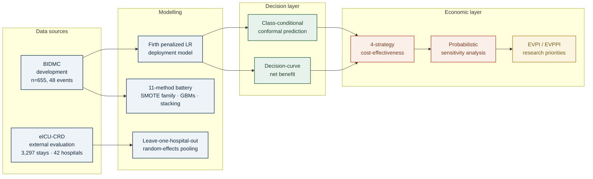

# csdh-postop-seizure-risk

[](LICENSE)
[](#requirements)
[](#reproducibility)

Companion code for the manuscript **"A calibrated and conformally-deployable risk score for postoperative seizure after chronic subdural haematoma evacuation: a proof-of-concept multi-database study with value-of-information analysis."**

This repository contains the analysis code, figure-generation scripts, decision-analytic implementation, and reporting artefacts. **No patient-level data are included.** Filtered, de-identified working subsets used in the manuscript are documented at [`docs/reviewer_access.md`](docs/reviewer_access.md) and released to authorised peer reviewers on request under the BIDMC IRB, eICU CRD, and HCUP NIS data-use agreements.

## Why this repository exists

The manuscript is a proof of concept: small-cohort clinical machine learning can be honestly deployable when calibration and decision-integration replace AUC as the optimisation target. This repository lets reviewers and the wider community reproduce the eleven-method modelling battery, the conformal risk stratification, the cost-effectiveness analysis with value-of-information, and the four-strategy decision tree.


> The Nationwide Inpatient Sample (NIS) was assessed but **excluded** from the primary analysis because available ICD-10 coding cannot reliably distinguish postoperative seizure after cSDH; it is documented in Supplementary Appendix S4 only. The main study uses two databases.

## Analysis pipeline



## What you can do with this code

- **Reproduce every figure and table in the manuscript.** Each script is a single-purpose, deterministic module that consumes either the BIDMC working CSV, the eICU CRD cohort export, or the NIS HCUP working file. With access to the underlying data the analyses run end-to-end on a laptop in under one hour.
- **Apply the Firth penalized logistic regression deployment model to new cohorts.** The model factory at `scripts/24_firth_bayes_lr.py` is sklearn-compatible.
- **Run class-conditional conformal prediction on any binary clinical outcome.** The Mondrian split-conformal implementation at `scripts/25_conformal_prediction.py` accepts any scikit-learn classifier as the base model.
- **Re-fit the four-strategy cost-effectiveness decision tree** at `scripts/14_decision_tree.py` and the probabilistic CEA + EVPI/EVPPI at `scripts/16_voi_evpi.py`.
- **Use the interactive companion site** at <https://nielspac177.github.io/csdh-postop-seizure-risk/> for the risk calculator, savings calculator and interactive callgraph.

## Repository layout

```
csdh-postop-seizure-risk/
├── README.md                       — this file
├── LICENSE                         — MIT
├── requirements.txt                — exact package versions for reproducibility
├── .gitignore                      — excludes /data/, /cache/, *.csv at root, *.pkl
├── CODE_REVIEW.md                  — prioritized code-quality recommendations
├── CALLGRAPH.md                    — module dependency graph
├── _config.yml                     — Jekyll configuration for the companion site
├── index.md                        — landing page for the companion site
├── site/                           — interactive companion site (calculator, savings, callgraph)
├── scripts/                        — analysis scripts (numbered in execution order)
│   ├── _shared.py
│   ├── 02_calibration.py
│   ├── 03_dca.py
│   ├── 04_loho.py
│   ├── 05_temporal_leakage.py
│   ├── 06_overfitting.py
│   ├── 07_missing_data.py
│   ├── 08_eicu_cohort.py
│   ├── 09_competing_risks.py
│   ├── 10_11_cea_pairwise.py
│   ├── 12_nis_seizure_reclassify.py
│   ├── 13_nis_grouped_lasso.py
│   ├── 14_decision_tree.py
│   ├── 15_radiology_nlp.py
│   ├── 16_voi_evpi.py
│   ├── 17_build_slides.py
│   ├── 18_bidmc_optimize.py
│   ├── 19_transfer_learning.py
│   ├── 20_build_manuscript.py
│   ├── 21_imbalance_sweep.py
│   ├── 22_diverse_stacking.py
│   ├── 23_tabpfn_eval.py
│   ├── 24_firth_bayes_lr.py
│   ├── 25_conformal_prediction.py
│   ├── 26_main_figures.py
│   ├── 27_build_jnnp_manuscript.py  — main + supplementary docx builder
│   ├── 28_make_callgraph.py
│   ├── 29_main_figures_jnnp.py      — journal-style figures F1–F6
│   └── 30_export_calculator_assets.py — JSON export for the interactive site
├── figures/                        — all generated PNG and PDF figures
├── results/                        — generated CSV result tables
└── docs/                           — manuscript draft, supplementary, lit review
    ├── main_manuscript.docx
    ├── supplementary.docx
    ├── imrad_plan.md
    ├── literature_review_imbalance_smallcohort.md
    └── reviewer_access.md
```

> The historical filenames `27_build_jnnp_manuscript.py` and `29_main_figures_jnnp.py` retain their original commit-traceable identifiers; their outputs are journal-agnostic.

## Quickstart

```bash
git clone https://github.com/nielspac177/csdh-postop-seizure-risk.git
cd csdh-postop-seizure-risk
python -m venv .venv && source .venv/bin/activate
pip install -r requirements.txt

# Reproduce all main paper figures (requires the working data files in /data/)
python scripts/02_calibration.py
python scripts/24_firth_bayes_lr.py
python scripts/25_conformal_prediction.py
python scripts/29_main_figures_jnnp.py

# Build the manuscript and supplementary documents
python scripts/27_build_jnnp_manuscript.py
```

## What each module computes

| Module | Inputs | Outputs | Key function |
|---|---|---|---|
| `_shared.py` | — | feature lists, pipeline factories, OOF prediction helper, calibration metrics | `oof_predictions()`, `calibration_metrics()` |
| `02_calibration.py` | BIDMC CSV, eICU CSV | calibration metrics CSV, calibration-curve figure | `run_one()` |
| `03_dca.py` | cached OOF predictions | net-benefit table and decision-curve figure | — |
| `04_loho.py` | eICU CSV | per-hospital and pooled summary CSVs, forest plot | `loho_for()`, `random_effects_pool()` |
| `05_temporal_leakage.py` | eICU CSV | leakage-audit CSV | `is_leakage_suspect_feature()` |
| `09_competing_risks.py` | BIDMC CSV | Cox + Fine-Gray c-index, Schoenfeld diagnostics | `fine_gray()` |
| `10_11_cea_pairwise.py` | parameter defaults | PSA samples, CEAC | `run_psa()`, `run_strategy()` |
| `14_decision_tree.py` | parameter defaults | TreeAge-style figure, rollback CSV | `rollback_strategy()`, `render_tree()` |
| `16_voi_evpi.py` | PSA samples | EVPI table, EVPPI tornado | `run_psa_tracked()`, `compute_evpi()`, `evppi_strong_oakley()` |
| `19_transfer_learning.py` | BIDMC + eICU | augmented OOF, DeLong test | `delong_test()`, `build_bidmc_transfer_X()` |
| `21_imbalance_sweep.py` | BIDMC CSV | 11-method comparison CSV | `pipe_with_sampler()`, `pipe_xgb_focal()` |
| `22_diverse_stacking.py` | BIDMC CSV | diverse-stack CSV | `make_diverse_stack()` |
| `24_firth_bayes_lr.py` | BIDMC + eICU CSV | Firth + Bayesian CSV | `BayesianLogReg`, `derive_eicu_priors()` |
| `25_conformal_prediction.py` | BIDMC CSV | conformal coverage and rule-out table | `class_conditional_conformal()` |
| `26_main_figures.py` | results CSVs and figures | F1–F6 consolidated figures | `figure_1` … `figure_6` |
| `27_build_jnnp_manuscript.py` | results, figures | main + supplementary docx | `build_main()`, `build_supplementary()` |
| `29_main_figures_jnnp.py` | results CSVs | F1–F6 in journal-style aesthetic | `figure_1`–`figure_6` |
| `30_export_calculator_assets.py` | BIDMC CSV | `site/model_assets.json` for the interactive site | `main()` |

## Package dependencies and why they were chosen

| Package | Version | Why this and not an alternative |
|---|---|---|
| `scikit-learn` | 1.5.2 | Industry-standard tabular ML; supports the full pipeline / `predict_proba` API used by the conformal layer. |
| `imbalanced-learn` | 0.12.4 | The canonical SMOTE-family implementation; `imblearn.ensemble.BalancedRandomForestClassifier` reproduces the published baseline; we did not switch frameworks to avoid behavioural drift relative to the original analysis. |
| `xgboost` | 2.1.4 | Used for `scale_pos_weight` and custom focal-loss objectives. We chose XGBoost over LightGBM as the primary GBM because of `scale_pos_weight` documentation and stability with small data. |
| `lightgbm` | 4.6.0 | Tested as a secondary GBM for sensitivity; ordered boosting variant of CatBoost was considered but was not necessary once the AUC ceiling was established. |
| `lifelines` | 0.30.0 | Cox proportional-hazards and Fine-Gray competing-risks fits; we required an explicit Schoenfeld residuals test which `lifelines` exposes natively. |
| `firthlogist` | 0.5.0 | Direct implementation of Firth's penalized likelihood. We chose it over the R `logistf` port for in-process integration and `predict_proba` compatibility. |
| `mapie` | 1.4.0 | Class-conditional and Mondrian conformal prediction with sklearn-compatible API. We elected MAPIE over `crepes` for tighter sklearn integration. |
| `optuna` | 4.8.0 | TPE sampler for hyperparameter tuning; used over scikit-learn's GridSearchCV for adaptive Bayesian optimization. |
| `python-docx` | 1.2.0 | Programmatic Word-document generation; we elected docx over LaTeX because most clinical-journal editorial workflows accept Word natively. |
| `python-pptx` | 1.0.2 | Programmatic PowerPoint for the oral-presentation deck. |
| `pandas` | 2.3.3 | Tabular manipulation throughout. |
| `numpy` | 1.26.4 | Numerical core; pinned at 1.26 for matplotlib 3.9.4 compatibility. |
| `matplotlib` | 3.9.4 | Publication-grade figures; we use a consistent style sheet across all scripts. |
| `Pillow` | 11.3 | Used in figure composition to embed sub-figures into composite plates. |
| `scipy` | 1.13 | Statistical testing (chi-square, Fisher exact, DeLong via norm CDF). |
| `lxml` + `xlsxwriter` | latest | Required by `python-docx` for Word file generation. |

## Reproducibility

- All scripts force `n_jobs = 1` and set `SEED = 42` (defined in `_shared.py`).
- The shell environment variables `OMP_NUM_THREADS`, `OPENBLAS_NUM_THREADS`, `MKL_NUM_THREADS` are set to `1` at the top of every numerical script for Apple-Silicon stability.
- Cross-validation splits are obtained from `RepeatedStratifiedKFold` with the same `random_state`, ensuring identical splits between scripts that consume cached out-of-fold predictions.
- All probabilistic sensitivity analyses use a single shared `numpy.random.Generator` seeded with `SEED`.
- A pinned `requirements.txt` file is provided.

## Reviewer access to filtered working data

De-identified working subsets — the 21-feature BIDMC table, the eICU non-traumatic cohort frame with the 103-variable Set C, and the NIS 2016–2019 chronic-SDH file — are held under access controls described in [`docs/reviewer_access.md`](docs/reviewer_access.md). Authorised reviewers may request the bundle via the corresponding author; access is granted through a separate private repository for the duration of the review process.

## Interactive companion site

A static companion site at <https://nielspac177.github.io/csdh-postop-seizure-risk/> provides three interactive tools, all running client-side in the browser without sending any data over the network:

- **Risk calculator** — enter a patient's features and obtain the Firth model's probability, the conformal prediction set at a user-chosen confidence level, and the resulting AED-versus-cEEG recommendation.
- **Population savings calculator** — enter an institutional or national operative volume and obtain the expected cost and QALY differential of ML-guided AED prophylaxis versus current standard of care.
- **Interactive callgraph** — node-link visualisation of the analysis scripts with click-to-inspect function inventories.

## Citation

If you use this code in your own research please cite:

> Pacheco-Barrios N, et al. A calibrated and conformally-deployable risk score for postoperative seizure after chronic subdural haematoma evacuation: a proof-of-concept multi-database study with value-of-information analysis. *Manuscript under review*, 2026.

A formal DOI (Zenodo) will be minted on acceptance.

## License

Code is released under the MIT license (see `LICENSE`). The cleaned NIS ICD-10 outcome codeset and the TreeAge-style decision-tree implementation are released under the same license. Data files remain under their respective data-use agreements (BIDMC IRB, eICU CRD, NIS HCUP) and are not part of this distribution.
