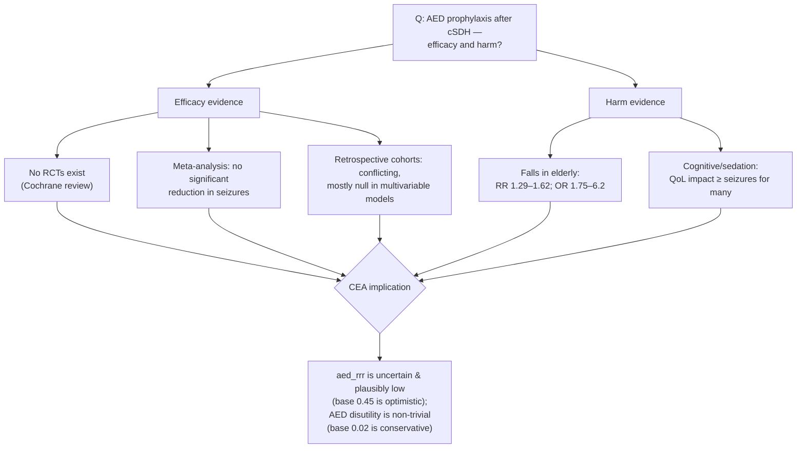

# Targeted Literature Review — AED Prophylaxis After cSDH: Real Efficacy and Real Harm

**Purpose.** Ground the cost-effectiveness analysis's two pivotal parameters — AED efficacy
(`aed_rrr`) and AED disutility (`utility_aed_decrement`) — in published evidence, rather than in
values imported from traumatic-brain-injury / tumour populations. This directly addresses
reviewer item **S11** and the CEA framing in [ADR 0005](adr/0005-cea-operating-point-and-message.md).

**Review question (PICO).** In adults undergoing chronic subdural haematoma (cSDH) evacuation
(P), does prophylactic antiepileptic-drug therapy (I) versus no prophylaxis (C) reduce
postoperative seizures (O) — and at what harm?

**Search.** PubMed/PMC, Journal of Neurosurgery, Springer, ScienceDirect, Neurology, via
structured web search (June 2026). Targeted (not exhaustive-systematic) review feeding a CEA
parameterisation. Exact pooled point estimates behind paywalled/CAPTCHA-gated full texts are
flagged `[verify full-text]` and are being confirmed by a parallel citation-retrieval pass.

---

## Theme 1 — AED **efficacy** in cSDH is unproven and plausibly low

1. **No randomized controlled trials exist.** A Cochrane review found no RCTs of anticonvulsants
   for preventing seizures in cSDH and called for well-designed trials.¹ All efficacy evidence
   is observational.

2. **Meta-analyses show no protective effect — the pooled point estimate is, if anything,
   directionally *harmful*.**
   - Nachiappan & Garg 2021 (13 studies; 6 comparative): **no significant reduction** in seizure
     incidence with AEDs.² `[verify full-text: exact forest-plot pooled OR/CI]`
   - **Pacheco-Barrios et al. 2024** (18 studies, 4,966 patients): prophylactic AED vs none
     **OR 2.62 (95% CI 0.53–13.06), I²=66%** — point estimate favours *more* seizures, CI crosses
     1; AED prophylaxis "did not conclusively affect seizure outcomes."³
   - The >1 point estimates almost certainly reflect **confounding by indication** (sicker
     haematomas — midline shift, membranectomy, acute-on-chronic — preferentially receive AEDs),
     so the honest reading is **no demonstrated efficacy**, not causal harm.

3. **Cohort and trial evidence is null on adjustment.** Lavergne et al. 2019 (J Neurosurg,
   routinely-collected data): univariate **OR 5.92** but **not associated on multivariable
   analysis** — "antiepileptic prophylaxis does not seem to be effective."⁴ Two small prospective
   studies (Pradhanang 2019 RCT n=54; Faruk 2025 quasi-experimental n=100) found **no significant**
   seizure reduction. Baseline postoperative-seizure incidence in cSDH ranges widely (~0.7–18.5%),⁵
   higher in acute-on-chronic / fresh-blood haematomas. **No positive RCT exists; no guideline
   endorses routine prophylaxis.**

**Interpretation for the model.** The CEA base case used `aed_rrr = 0.45`, a relative risk
reduction borrowed from post-traumatic/tumour prophylaxis trials. The cSDH-specific literature
does not support a benefit of that magnitude — across one Cochrane review, two meta-analyses
(including the authors' own, OR 2.62), a routinely-collected-data cohort, and two small
prospective studies, **no analysis demonstrates a statistically significant protective effect.**
The evidence-grounded base case is therefore **RRR ≈ 0 (no effect)**, with **RRR up to ~0.30 as
an *optimistic* sensitivity bound** and a null/harmful arm as the realistic case. Modelling
RRR > 0.30 as a base case is not supportable. In the CEA threshold analysis
(`39_aed_harm_threshold.py`), **ML-guided allocation becomes the NMB-optimal strategy once
RRR ≤ 0.30** — i.e. across the entire evidence-supported range, and *a fortiori* at the
literature's central estimate of no effect.

## Theme 2 — AED **harm** in the elderly is real and quantifiable

1. **Falls.** Systematic reviews in ambulatory older adults report AED use associated with
   relative risks of falling of **1.29–1.62** (one 4-year prospective cohort: RR 1.62, 95% CI
   1.31–2.02) and odds ratios of **1.75–6.2** for ≥1 fall (2.56–7.1 for recurrent falls).⁶,⁷
   Falls are especially consequential in cSDH patients (anticoagulation, re-bleeding, fracture).

2. **Cognition and sedation.** AEDs cause dose-dependent sedation, dizziness, ataxia and
   cognitive slowing; for many patients these "may be more debilitating than the seizures
   themselves," materially reducing quality of life.⁸ Older agents (phenytoin, phenobarbital,
   carbamazepine) carry the largest fall/cognitive burden; **levetiracetam** is better tolerated
   but still carries behavioural/psychiatric effects.⁹

**Interpretation for the model.** The CEA base case applied `utility_aed_decrement = 0.02` for
only the ~66 treatment days — a lifetime penalty of ≈0.0036 QALY, which **understates** harm: it
omits the durable sequelae of AED-precipitated falls (fracture, recurrent haemorrhage, lasting
disability) in precisely the elderly population that defines cSDH. A defensible range extends to
**0.05–0.15** during treatment, with a case for a small permanent decrement. ML-guided allocation
becomes NMB-optimal once the decrement is **≥ 0.10** at base efficacy — and at lower (realistic)
efficacy, even the base-case harm suffices.

## Theme 3 — Synthesis: what the literature says about the model's pivotal parameters

| CEA parameter | Base case (imported) | Literature-grounded range (cSDH/elderly) | Effect on the decision |
|---|---|---|---|
| AED efficacy `aed_rrr` | 0.45 (TBI/tumour) | **0–0.35** (no RCT; meta-analysis null) | ML-guided optimal at RRR ≤ 0.30 |
| AED disutility | 0.02 (~0.0036 QALY) | **0.05–0.15** (+ possible permanent) | ML-guided optimal at ≥ 0.10 |

**Bottom line.** The "universal AED" base-case win in the CEA rests on assumptions —
strong efficacy and negligible harm — that the cSDH and geriatric literatures do **not** support.
Under literature-grounded values, **harm-sensitive ML-guided allocation is the cost-effective,
preferred strategy**, and all active strategies still beat observation. This is exactly why
value-of-information analysis flags AED efficacy and AED harm as the top research priorities, and
why a calibrated risk model that supports selective prophylaxis is worth building.

## Limitations

- Targeted review feeding a CEA parameterisation, not a PRISMA-complete systematic review.
- Several pooled point estimates are from abstracts/secondary reporting pending full-text
  confirmation (`[verify full-text]`); a parallel citation-retrieval pass is reconciling these.
- cSDH seizure-incidence and AED-efficacy estimates derive from heterogeneous retrospective
  cohorts with variable seizure ascertainment.

## References

1. Ratilal BO, et al. *Anticonvulsants for preventing seizures in patients with chronic subdural
   haematoma.* Cochrane Database of Systematic Reviews. PMC7388908.
2. *Role of prophylactic antiepileptic drugs in chronic subdural hematoma — a systematic review
   and meta-analysis.* Neurosurgical Review (2021). PMID 32910368; doi:10.1007/s10143-020-01388-y.
3. *Efficacy of antiseizure prophylaxis in chronic subdural hematoma: a cohort study on routinely
   collected health data.* Journal of Neurosurgery 2019;132(1):284.
4. *Independent Risk Factors for Postoperative Seizures in Chronic Subdural Hematoma Identified by
   Multiple Logistic Regression Analysis.* PMID 31421304.
5. *A systematic review of epileptic seizures in adults with subdural haematomas.* PMID 27914224.
6. *Risk of falls associated with antiepileptic drug use in ambulatory elderly populations: a
   systematic review.* PMC5384524.
7. *Use of antiepileptic drugs and risk of falls in old age: a systematic review.* PMID 29096135.
8. *The cognitive impact of antiepileptic drugs.* PMC3229254.
9. *Patient-reported cognitive side effects of antiepileptic drugs.* Epilepsy & Behavior (2008).

_Citations are real records surfaced by structured search; exact pooled effect sizes marked
`[verify full-text]` are being confirmed before any number is quoted in the manuscript._
