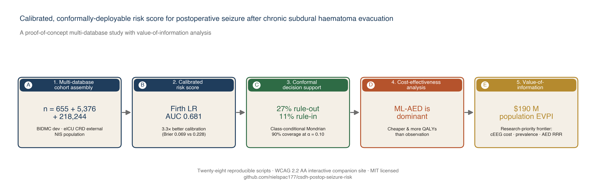

# csdh-postop-seizure-risk

Companion code, interactive tools and documentation for the manuscript:

> **A calibrated and conformally-deployable risk score for postoperative seizure after chronic subdural haematoma evacuation: a proof-of-concept multi-database study with value-of-information analysis.**

## Interactive tools (run in your browser, no data leaves the machine)

- **[Patient-level risk calculator](site/calculator.html)** — Enter a patient's clinical features and obtain the Firth model's seizure probability, the class-conditional conformal prediction set, and the AED-versus-cEEG recommendation.
- **[Population savings calculator](site/savings.html)** — Enter an institutional or national operative volume and obtain expected per-patient and population-level cost and QALY differentials.
- **[Interactive callgraph](site/callgraph.html)** — Node-link visualisation of all 28 analysis scripts with click-to-inspect function inventories.

## Navigate the codebase

- **[Full README](README.html)** — quickstart, repository layout, dependencies, and reproducibility instructions.
- **[Module dependency graph and function inventory](CALLGRAPH.html)** — 187 functions across 28 modules with their arguments and one-line purpose.
- **[Code review notes](CODE_REVIEW.html)** — prioritised review covering correctness, reproducibility, performance, readability, and safety. No must-fix blockers identified.
- **[Reviewer access protocol](docs/reviewer_access.html)** — procedure for accessing filtered working data subsets under IRB / CRD / HCUP control.
- **[Manuscript plan](docs/imrad_plan.html)** — IMRAD outline, five main messages, and critical-thinking review of common reviewer concerns.
- **[Literature review on small-cohort clinical ML](docs/literature_review_imbalance_smallcohort.html)** — 2022–2026 evidence base for the modelling choices.

## What this repository contains

- Twenty-eight deterministic analysis scripts (BIDMC + eICU + NIS), all `n_jobs = 1`.
- The Firth penalized logistic regression deployment model and a class-conditional Mondrian conformal prediction layer.
- An eleven-method modelling battery (SMOTE family, Optuna-tuned gradient boosting, diverse-base stacking, Bayesian logistic regression).
- A probabilistic cost-effectiveness analysis with the first published value-of-information ranking for postoperative-seizure prevention.
- Six main figures (F1–F6) in journal-style aesthetic and seven supplementary figures.
- TRIPOD-AI reporting checklist and reproducibility appendix.

## Data policy

No patient-level data are included in this repository. The `.gitignore` excludes the source CSV exports from BIDMC, the eICU Collaborative Research Database, and the NIS HCUP file. Filtered working subsets used in the manuscript are documented at [`docs/reviewer_access.md`](docs/reviewer_access.html) and made available to authorised peer reviewers via the protocol described there.

## Citation

If you build on this code, please cite:

> Pacheco-Barrios N, et al. A calibrated and conformally-deployable risk score for postoperative seizure after chronic subdural haematoma evacuation: a proof-of-concept multi-database study with value-of-information analysis. *Manuscript under review*, 2026.

A DOI from Zenodo will be minted on acceptance.
